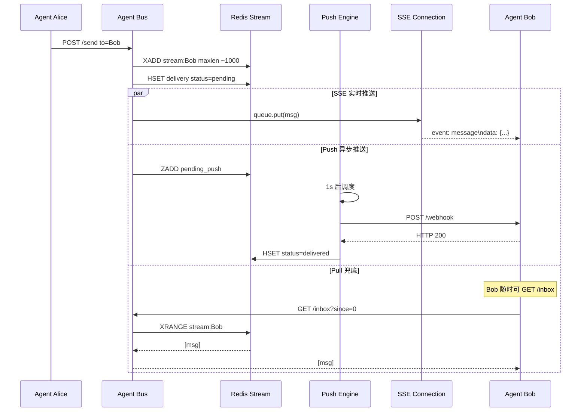
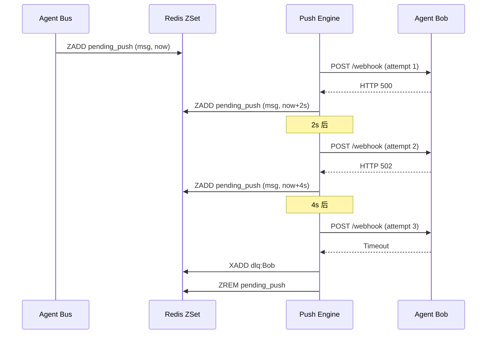
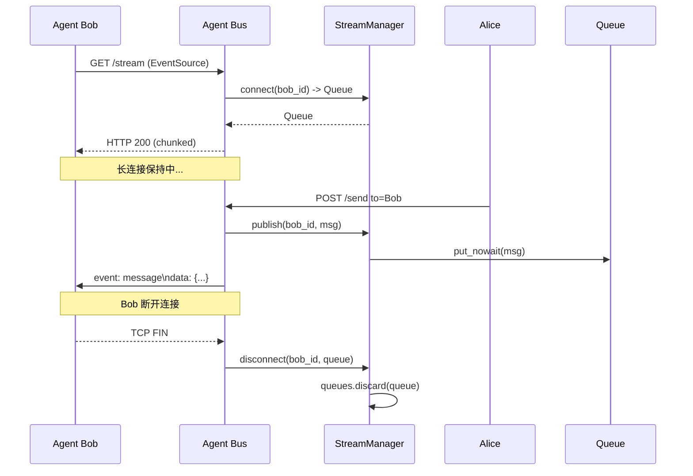

# Agent Bus 架构设计文档 v2.0

> **版本**: v2.0  
> **日期**: 2026-05-02  
> **核心变更**: Push(Webhook) + Pull(轮询) + SSE(流式) 三种交付机制全覆盖，Redis Stream 有界队列

---

## 1. 设计目标

让 Agent Bus 成为**中心化的信息中枢**，支持任意 Agent 以三种方式接收消息：

1. **主动推送 (Push/Webhook)** — Bus 主动 HTTP POST 到 Agent 的回调地址
2. **被动拉取 (Pull/Polling)** — Agent 定时 `GET /inbox` 轮询
3. **实时流式 (SSE/Streaming)** — Agent 建立长连接，Bus 实时推送

> 设计哲学：**Push 加速通知，SSE 实时送达，Pull 兜底保障**。三种机制互补共存，Agent 按需选择。

---

## 2. 系统架构全景

```
┌─────────────────────────────────────────────────────────────────────────────┐
│                              外部世界                                         │
│  ┌──────────┐  ┌──────────┐  ┌──────────┐  ┌──────────────────────────┐    │
│  │  人类用户 │  │  Claude  │  │  Kimi   │  │   外部 Agent (webqa等)   │    │
│  │ (Web/UI) │  │  Code   │  │  Code   │  │  有自己的 HTTP endpoint  │    │
│  └────┬─────┘  └────┬─────┘  └────┬─────┘  └──────────┬───────────────┘    │
│       │             │             │                   │                    │
│       │ HTTP/WebSocket│ HTTP轮询   │ HTTP轮询         │ HTTP POST (Push)   │
│       │             │             │                   │◄────────────────── │
│       │             │             │                   │                    │
│       │             │             │◄──────────────────────────────────────│
│       │             │             │         SSE Streaming (长连接实时)      │
│       │             │             │                   │                    │
└───────┼─────────────┼─────────────┼───────────────────┼────────────────────┘
        │             │             │                   │
        ▼             ▼             ▼                   ▼
┌─────────────────────────────────────────────────────────────────────────────┐
│                        Agent Bus (FastAPI HTTP服务)                          │
│  ┌─────────────────────────────────────────────────────────────────────────┐│
│  │                      /v1/switchboard                                     ││
│  │  ┌──────────────┐  ┌──────────────┐  ┌──────────────┐  ┌────────────┐  ││
│  │  │   /register  │  │    /send     │  │   /inbox     │  │  /stream   │  ││
│  │  │   (注册中心)  │  │   (消息总线)  │  │   (轮询-Pull) │  │  (SSE实时) │  ││
│  │  └──────────────┘  └──────┬───────┘  └──────────────┘  └────────────┘  ││
│  │  ┌──────────────┐         │         ┌──────────────────────────────┐   ││
│  │  │ /webhooks/*  │◄────────┘────────►│     Push Delivery Engine     │   ││
│  │  │ (接收推送回执)│                   │     (主动推送引擎)            │   ││
│  │  └──────────────┘                   │  • 异步 HTTP 客户端           │   ││
│  │                                      │  • 指数退避重试               │   ││
│  │  ┌──────────────┐                   │  • 熔断器 + DLQ               │   ││
│  │  │  /agents     │                   └──────────────────────────────┘   ││
│  │  │  (发现Agent)  │                                                      ││
│  │  └──────────────┘                                                      ││
│  └─────────────────────────────────────────────────────────────────────────┘│
│                                    │                                        │
│                                    ▼                                        │
│  ┌─────────────────────────────────────────────────────────────────────┐   │
│  │                    Store (存储层) — Redis Stream                      │   │
│  │  ┌─────────────┐  ┌──────────────────────────┐  ┌───────────────┐  │   │
│  │  │  Agents     │  │  Inbox Stream (有界队列)  │  │   DLQ Stream   │  │   │
│  │  │  (Agent Card)│  │  • MAXLEN ~ 1000/agent   │  │  • 推送失败    │  │   │
│  │  │  + webhook   │  │  • 消息 ID 自带时间戳     │  │  • 过期/超限   │  │   │
│  │  └──────────────┘  │  • XRANGE 按时间范围读取  │  │               │  │   │
│  │                    └──────────────────────────┘  └───────────────┘  │   │
│  │  ┌─────────────────────────────────────────────────────────────────┐│   │
│  │  │              Delivery State (投递状态 Hash)                      ││   │
│  │  │  msg_id | agent_id | channel | status | attempts | last_error   ││   │
│  │  └─────────────────────────────────────────────────────────────────┘│   │
│  │  ┌─────────────────────────────────────────────────────────────────┐│   │
│  │  │              Pending Push (调度 ZSet)                            ││   │
│  │  │  member=msg_id:agent_id, score=下次重试时间戳                     ││   │
│  │  └─────────────────────────────────────────────────────────────────┘│   │
│  └─────────────────────────────────────────────────────────────────────┘   │
└─────────────────────────────────────────────────────────────────────────────┘
```

---

## 3. 三种交付机制详解

### 3.1 对比矩阵

| 维度 | Pull (轮询) | Push (Webhook) | SSE (流式) |
|------|-------------|----------------|------------|
| **实时性** | 低（30s 周期） | 中（1s 调度） | 高（毫秒级） |
| **Agent 要求** | 无 | 需暴露 HTTP endpoint | 需保持长连接 |
| **网络要求** | 出网即可 | 需公网/内网可达 | 出网即可 |
| **复杂度** | 低 | 中 | 低 |
| **适用场景** | 简单集成、防火墙后 | 服务器间集成 | 实时 Dashboard、交互式 |
| **A2A 映射** | tasks/get | PushNotificationConfig | SSE streaming |

### 3.2 交付决策流程

```
消息发送
    │
    ▼
┌─────────────────────────┐
│  目标 Agent 有 SSE 连接?  │──Yes──► 实时推送到 SSE 连接
└─────────────────────────┘
    No
    ▼
┌─────────────────────────┐
│  目标 Agent 有 webhook?   │──Yes──► 加入 pending_push，
│  且 delivery_preference   │        异步 HTTP POST 推送
│  != "pull"?               │
└─────────────────────────┘
    No
    ▼
┌─────────────────────────┐
│     存入 Redis Stream     │──────► Agent 通过 GET /inbox 拉取
│     (Pull 兜底保障)       │
└─────────────────────────┘
```

---

## 4. 核心模块设计

### 4.1 模块依赖图

```
┌─────────────────────────────────────────────┐
│              agent_bus.main                  │
│  ┌─────────┐ ┌─────────┐ ┌───────────────┐ │
│  │ Router  │ │ Stream  │ │ PushDelivery  │ │
│  │ (API)   │ │ Manager │ │ Engine        │ │
│  └────┬────┘ └────┬────┘ └───────┬───────┘ │
│       │           │              │         │
│       └───────────┼──────────────┘         │
│                   ▼                        │
│           ┌─────────────┐                  │
│           │    Store    │                  │
│           │ (Redis/Mem) │                  │
│           └─────────────┘                  │
└─────────────────────────────────────────────┘
```

### 4.2 StreamManager（SSE 管理器）

```python
class StreamManager:
    _queues: Dict[str, Set[asyncio.Queue]]
    
    connect(agent_id) -> Queue     # Agent 建立 SSE 连接
    disconnect(agent_id, queue)    # 断开连接，清理资源
    publish(agent_id, data) -> int # 向所有连接广播
```

- **无锁设计**: `asyncio.Lock` 保护队列集合的增删
- **背压保护**: 单个 Queue `maxsize=100`，满则丢弃
- **多连接支持**: 一个 Agent 可以同时有多个 SSE 客户端（如 Dashboard + Agent 本体）

### 4.3 PushDeliveryEngine（推送引擎）

```python
class PushDeliveryEngine:
    _scheduler_loop()   # 每秒扫描 pending_push ZSet
    _push_one(msg, webhook) -> bool  # httpx.AsyncClient 异步 POST
    _handle_failure()   # 指数退避重试 or 移入 DLQ
```

- **Worker 池**: `asyncio.Semaphore(max_workers)` 限制并发推送数
- **重试策略**: `backoff = 2^attempts` 秒，最多 3 次
- **DLQ 触发**: 失败 3 次后进入死信队列，Admin 可手动重试

### 4.4 RedisStore（Stream 改造）

| Key 模式 | 类型 | 用途 |
|----------|------|------|
| `agent_bus:stream:{agent_id}` | Stream | 每个 Agent 的消息收件箱，带 MAXLEN |
| `agent_bus:delivery` | Hash | 投递状态记录 |
| `agent_bus:pending_push` | ZSet | 待推送消息调度队列 |
| `agent_bus:dlq:{agent_id}` | Stream | 死信队列 |
| `agent_bus:agents` | Hash | Agent Card 注册表 |

---

## 5. 关键时序图

### 5.1 消息发送 — 三模并发



### 5.2 Push 失败 → 重试 → DLQ



### 5.3 SSE 连接生命周期



---

## 6. API 清单

### 6.1 核心 API

| 方法 | 路径 | 说明 |
|------|------|------|
| POST | `/v1/switchboard/register` | 注册，可选带 webhook 配置 |
| POST | `/v1/switchboard/send` | 发送消息，返回 delivery_channel |
| GET | `/v1/switchboard/inbox` | 轮询收件箱 (Pull) |
| **GET** | **`/v1/switchboard/stream`** | **SSE 实时流 (Streaming)** |
| POST/GET/DELETE | `/v1/switchboard/webhook` | Webhook 配置管理 (Push) |
| POST | `/v1/switchboard/messages/{id}/ack` | 消息回执确认 |

### 6.2 Admin API

| 方法 | 路径 | 说明 |
|------|------|------|
| GET | `/admin/delivery` | 投递状态查询 |
| GET | `/admin/dlq` | 死信队列列表 |
| POST | `/admin/dlq/{msg_id}/retry` | 手动重试死信 |

---

## 7. 与 Google A2A 协议映射

| A2A 概念 | Agent Bus 实现 | 状态 |
|----------|---------------|------|
| AgentCard | `AgentCard` + `WebhookConfig` | ✅ 对齐 |
| tasks/send | `POST /send` | ✅ 已有 |
| tasks/get (Polling) | `GET /inbox` | ✅ 已有 |
| **SSE Streaming** | **`GET /stream`** | ✅ **新增** |
| **PushNotificationConfig** | **`WebhookConfig`** | ✅ **新增** |
| TaskStatusUpdateEvent | `DeliveryRecord` | ✅ 新增 |
| OAuth2 / API Key | `X-Agent-Id` + `X-Token` | 简化版 |

---

## 8. 配置参考

```bash
# Redis 后端（db 1，避开默认 db 0）
REDIS_URL=redis://localhost:6379/1

# Push 功能开关
AGENT_BUS_PUSH_ENABLED=true

# Push 引擎参数
AGENT_BUS_PUSH_WORKERS=10
AGENT_BUS_PUSH_TIMEOUT=10
AGENT_BUS_PUSH_MAX_RETRY=3
AGENT_BUS_PUSH_BACKOFF_BASE=2

# 队列参数
AGENT_BUS_QUEUE_MAXLEN=1000
AGENT_BUS_QUEUE_TTL_DAYS=7
```

---

## 9. 向后兼容说明

- **MemoryStore / MongoStore**: 原有行为不变，Push Engine 和 SSE 同样生效
- **RedisStore**: 从简单 list 升级为 Stream，`get_inbox` 接口保持兼容
- **无 webhook 的 Agent**: 完全无感知，继续纯 Pull 工作
- **旧版 SDK**: `AgentBusClient` 继续可用，新增方法为可选扩展

---

*本文档对应代码版本: commit `c935763`*
