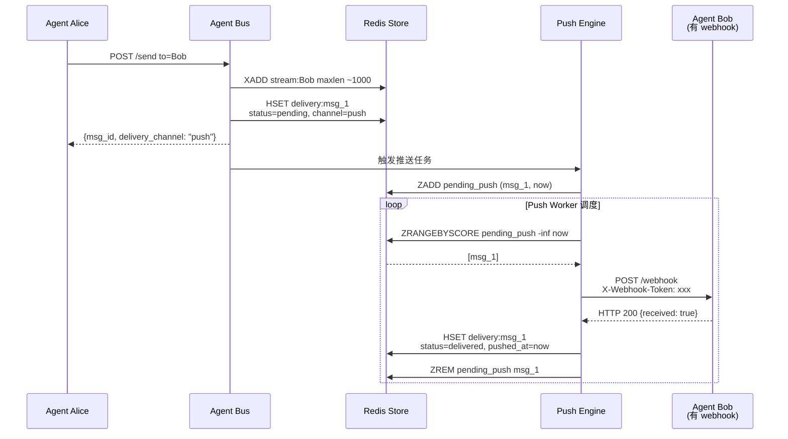
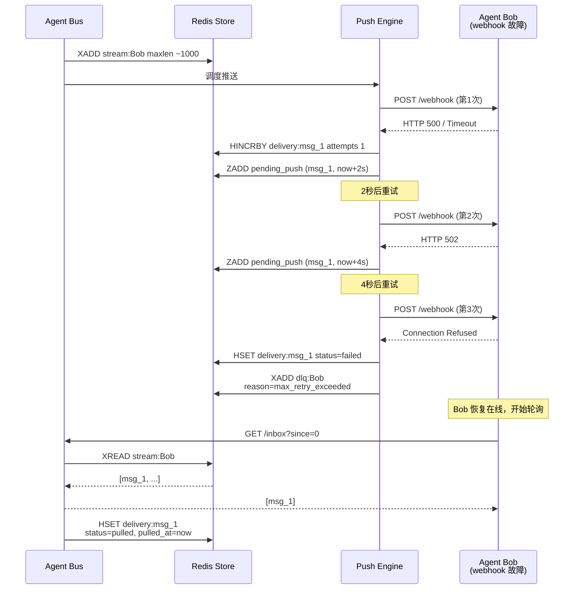

# Agent Bus 中心化消息中枢升级方案

> **版本**: v1.0  
> **日期**: 2026-05-02  
> **背景**: 小 leader 要求基于 a2a-go vibe，验证中心化信息中枢 + 主动推送(Push) + 被动拉取(Pull) + Redis 有界消息队列的可行性。本方案作为 POC 阶段的详细设计文档，供评审后决定是否投入开发。

---

## 1. 背景与目标

### 1.1 当前现状

当前 `simple-a2a`（内部代号 Agent Bus）已实现：

- **注册中心**: Agent 上线注册，获取 `agent_id` + `token`
- **消息总线**: 纯 `POST /send` + `GET /inbox` 轮询模式（Pull Only）
- **群组广播**: 消息复制到所有成员 inbox
- **人类确认**: 危险操作的人工审批流
- **存储后端**: MemoryStore（默认）/ RedisStore / MongoStore
- **管理后台**: Admin Dashboard 可视化

### 1.2 核心痛点

| 痛点 | 说明 | 影响 |
|------|------|------|
| **无主动推送** | 消息只能被动轮询，Agent 无法实时感知 | 延迟高（30s 轮询周期），资源浪费 |
| **无 Webhook 机制** | 外部 Agent 有自己的服务地址，Bus 无法回调 | 不符合 A2A 协议标准，集成受限 |
| **Redis 队列裸奔** | 当前 Redis 用 `rpush/lrange`，无长度限制、无 TTL | 内存膨胀风险，无背压保护 |
| **消息无优先级** | 所有消息平级处理 | 系统消息可能被业务消息淹没 |
| **无投递状态追踪** | 不知道消息是否成功推送到 Agent | 无法做故障恢复和监控 |

### 1.3 目标（对标 Google A2A 协议）

Google A2A 协议定义了三种任务更新交付机制：

1. **Polling** — 客户端周期性查询（当前已有 ✅）
2. **Streaming** — SSE 实时流（未来可考虑，本次不做）
3. **Push Notifications** — Webhook 异步推送（本次核心目标 🎯）

本次 POC 目标：

- ✅ **保留并增强 Pull 模式**: 轮询收件箱继续可用，增加队列长度上限
- 🎯 **新增 Push 模式**: Agent 注册时提供 Webhook URL，Bus 主动 HTTP POST 推送
- 🎯 **Redis 可靠队列**: 替换简单 list，引入有界队列 + TTL + 死信队列
- 🎯 **投递状态追踪**: 每条消息记录 push/pull 状态，支持 admin 监控
- 🎯 **A2A 语义对齐**: AgentCard / PushNotificationConfig 等概念与 A2A 协议映射

---

## 2. 总体架构设计

### 2.1 架构全景

```
┌─────────────────────────────────────────────────────────────────────────────┐
│                              外部世界                                         │
│  ┌──────────┐  ┌──────────┐  ┌──────────┐  ┌──────────────────────────┐    │
│  │  人类用户 │  │  Claude  │  │  Kimi   │  │   外部 Agent (webqa等)   │    │
│  │ (Web/UI) │  │  Code   │  │  Code   │  │  有自己的 HTTP endpoint  │    │
│  └────┬─────┘  └────┬─────┘  └────┬─────┘  └──────────┬───────────────┘    │
│       │             │             │                   │                    │
│       │ HTTP/WebSocket│ HTTP轮询   │ HTTP轮询         │ HTTP POST (Push)   │
│       │             │             │                   │◄────────────────── │
│       │             │             │                   │                    │
└───────┼─────────────┼─────────────┼───────────────────┼────────────────────┘
        │             │             │                   │
        ▼             ▼             ▼                   ▼
┌─────────────────────────────────────────────────────────────────────────────┐
│                        Agent Bus (HTTP服务) — 本次升级范围                     │
│  ┌─────────────────────────────────────────────────────────────────────────┐│
│  │                      /v1/switchboard                                     ││
│  │  ┌──────────────┐  ┌──────────────┐  ┌──────────────┐  ┌────────────┐  ││
│  │  │   /register  │  │    /send     │  │   /inbox     │  │  /groups   │  ││
│  │  │   (注册中心)  │  │   (消息总线)  │  │   (轮询-Pull) │  │  (群组管理) │  ││
│  │  └──────────────┘  └──────┬───────┘  └──────────────┘  └────────────┘  ││
│  │  ┌──────────────┐         │         ┌──────────────────────────────┐   ││
│  │  │ /webhooks/*  │◄────────┘────────►│     Push Delivery Engine     │   ││
│  │  │ (接收推送回执)│                   │     (主动推送引擎)            │   ││
│  │  └──────────────┘                   │  • 异步 HTTP 客户端           │   ││
│  │                                      │  • 指数退避重试               │   ││
│  │  ┌──────────────┐                   │  • 熔断器                     │   ││
│  │  │  /agents     │                   │  • 投递状态追踪               │   ││
│  │  │  (发现Agent)  │                   └──────────────────────────────┘   ││
│  │  └──────────────┘                                                      ││
│  └─────────────────────────────────────────────────────────────────────────┘│
│                                    │                                        │
│                                    ▼                                        │
│  ┌─────────────────────────────────────────────────────────────────────┐   │
│  │                    Store (存储层) — Redis 改造                         │   │
│  │  ┌─────────────┐  ┌──────────────────────────┐  ┌───────────────┐  │   │
│  │  │  Agents     │  │  Inbox Queue (有界队列)   │  │   DLQ (死信)   │  │   │
│  │  │  (Agent Card)│  │  • maxlen per agent      │  │  • 过期/超限   │  │   │
│  │  │  + webhook   │  │  • TTL per message       │  │  • 推送失败    │  │   │
│  │  └──────────────┘  │  • 优先级                 │  │               │  │   │
│  │                    └──────────────────────────┘  └───────────────┘  │   │
│  │  ┌─────────────────────────────────────────────────────────────────┐│   │
│  │  │              Delivery State (投递状态表)                         ││   │
│  │  │  msg_id | agent_id | channel | status | attempts | last_error   ││   │
│  │  └─────────────────────────────────────────────────────────────────┘│   │
│  └─────────────────────────────────────────────────────────────────────┘   │
└─────────────────────────────────────────────────────────────────────────────┘
```

### 2.2 核心设计决策

| 决策点 | 选择 | 理由 |
|--------|------|------|
| **Push 协议** | HTTP POST + JSON (Webhook) | 与 A2A 协议一致，最简单通用，Agent 只需一个 HTTP endpoint |
| **Push 时机** | 消息入队后立即异步推送 | 低延迟；失败不影响入队 |
| **Push 失败处理** | 指数退避重试 3 次 + 死信队列 | 避免无限重试压垮 Bus |
| **队列类型** | Redis Stream (优先) 或 capped list | Stream 支持消费者组、ACK、 maxlen；备选 list + ltrim |
| **队列上限** | 每 Agent 1000 条（可配置） | 防止内存无限增长 |
| **消息 TTL** | 7 天（可配置） | 自动清理过期消息 |
| **双模共存** | Push 失败自动降级为 Pull | 保证消息必达，Agent 无需强制暴露 webhook |
| **Agent 侧要求** | Webhook 是可选的 | 不暴露 webhook 的 Agent 仍然用纯 Pull |

---

## 3. 核心模块详细设计

### 3.1 Agent Card 扩展 — 支持 Webhook 注册

当前 `AgentCard` 模型需要扩展，以支持 A2A 协议的 `PushNotificationConfig`：

```python
# models.py 变更

class WebhookConfig(BaseModel):
    """Agent 的推送回调配置，对齐 A2A PushNotificationConfig."""
    url: str = Field(..., description="Webhook 回调地址，Bus 将 POST 消息到此 URL")
    token: str = Field(default="", description="验证令牌，Bus 推送时带在 X-Webhook-Token 头")
    auth_scheme: Literal["bearer", "header_token", "none"] = Field(default="none")
    # A2A 风格：agent 可以声明自己支持的交付机制
    enabled: bool = Field(default=True)

class AgentCard(BaseModel):
    agent_id: str
    name: str
    capabilities: list[str]
    limitations: list[str]
    announcement: str
    labels: list[str]
    online: bool
    registered_at: datetime
    last_seen: datetime
    # === 新增字段 ===
    webhook: Optional[WebhookConfig] = Field(default=None, description="推送配置，为空则仅支持 Pull")
    delivery_preference: Literal["push", "pull", "both"] = Field(default="both", description="首选交付方式")
```

注册时 Agent 可选择性提供 webhook：

```json
// POST /register 请求体扩展
{
  "name": "webqa-agent",
  "capabilities": ["browser_automation", "qa"],
  "webhook": {
    "url": "https://webqa.example.com/a2a/webhook",
    "token": "whk_xxx",
    "auth_scheme": "header_token"
  },
  "delivery_preference": "push"
}
```

### 3.2 消息模型扩展 — 投递状态追踪

```python
class DeliveryRecord(BaseModel):
    """单条消息的投递记录."""
    msg_id: str
    agent_id: str          # 目标 Agent
    channel: Literal["push", "pull"]  # 实际使用的通道
    status: Literal["pending", "delivered", "failed", "pulled"]
    attempts: int = 0      # Push 尝试次数
    last_error: Optional[str] = None
    pushed_at: Optional[datetime] = None   # 首次推送时间
    pulled_at: Optional[datetime] = None   # 被拉取时间
    confirmed_at: Optional[datetime] = None # Agent 回执确认时间
```

### 3.3 Redis 消息队列设计 — 有界队列

当前 `RedisStore` 使用简单 `rpush/lrange`，需要改造为可靠队列。

#### 方案 A: Redis Stream（推荐）

Redis Stream 是原生消息队列，支持：
- `MAXLEN ~ 1000` — 近似有界长度
- 消费者组 + ACK 机制
- 消息 ID 自带时间戳
- `XADD` / `XREAD` / `XACK` / `XPENDING`

```
# Redis key 设计
agent_bus:stream:{agent_id}     # 每个 agent 一个 Stream
agent_bus:dlq:{agent_id}        # 死信队列 (Stream 或 list)
agent_bus:delivery:{msg_id}     # 投递状态 Hash
agent_bus:pending_push          # 待推送 Sorted Set (score=下次重试时间)
```

入队逻辑：
```python
def add_message(self, msg: Message) -> None:
    # 1. 写入 Stream，限制长度
    self._client.xadd(
        self._key("stream", msg.to),
        {"data": msg.model_dump_json()},
        maxlen=MAXLEN,  # 全局配置，如 1000
        approximate=True
    )
    # 2. 记录投递状态
    self._record_delivery(msg)
    # 3. 如果目标 agent 有 webhook，加入待推送队列
    if self._agent_has_webhook(msg.to):
        self._schedule_push(msg)
```

#### 方案 B: Capped List（兼容当前，改动小）

如果团队对 Stream 不熟悉，可用 `lpush + ltrim` 实现有界 list：

```python
def add_message(self, msg: Message) -> None:
    key = self._key("inbox", msg.to)
    pipe = self._client.pipeline()
    pipe.lpush(key, msg.model_dump_json())   # 从左侧插入，最新的在前
    pipe.ltrim(key, 0, MAXLEN - 1)            # 只保留前 MAXLEN 条
    pipe.expire(key, TTL_SECONDS)             # 整个队列 TTL
    pipe.execute()
```

**推荐方案 A（Stream）**，因为：
- Stream 支持多个消费者（未来可扩展为多个 Bus 实例消费）
- 天然支持消息 ID 和时间戳
- 可追踪哪些消息已被处理（ACK）
- 与 Kafka 语义接近，团队熟悉后易于迁移

### 3.4 Push Delivery Engine — 主动推送引擎

这是本次升级的核心新增模块。

#### 架构

```
┌─────────────────────────────────────────┐
│         Push Delivery Engine            │
│  ┌─────────────┐    ┌─────────────┐    │
│  │  Scheduler  │───►│ Worker Pool │    │
│  │  (调度器)    │    │ (工作协程)   │    │
│  └─────────────┘    └──────┬──────┘    │
│         ▲                  │            │
│         │                  ▼            │
│  ┌──────┴──────┐    ┌─────────────┐    │
│  │  Redis      │    │ HTTP Client │    │
│  │  pending_push│    │ (async)     │    │
│  └─────────────┘    └──────┬──────┘    │
│                            │            │
│         ┌──────────────────┼────────┐   │
│         ▼                  ▼        ▼   │
│    [成功]              [失败]    [超时]  │
│         │                  │        │   │
│         ▼                  ▼        ▼   │
│    更新状态            重试调度    重试   │
│    delivered           (退避)    (退避)  │
└─────────────────────────────────────────┘
```

#### 核心流程

1. **消息入队触发**: `add_message()` 检测到目标 agent 有 webhook，将 `msg_id` 写入 `pending_push` Sorted Set，score 为当前时间戳
2. **调度器轮询**: 后台协程每 1s 从 `pending_push` 中取出 score <= now 的条目
3. **HTTP 推送**: Worker 使用 `httpx.AsyncClient` 向 agent webhook URL 发送 POST
4. **结果处理**:
   - HTTP 2xx → 更新状态为 `delivered`，从 pending 移除
   - HTTP 非 2xx / 超时 → 检查 attempts < 3，计算退避时间（如 2^attempts 秒），重新放入 `pending_push`
   - attempts >= 3 → 移入 DLQ，状态标记 `failed`

#### 推送 Payload（对齐 A2A）

```http
POST {agent_webhook_url} HTTP/1.1
Content-Type: application/json
X-Webhook-Token: {agent_webhook_token}
X-Agent-Bus-Version: 1.1.0

{
  "event": "message.received",
  "timestamp": "2026-05-02T10:00:00Z",
  "message": {
    "msg_id": "msg_xxx",
    "msg_type": "task",
    "from_agent": "agent_alice",
    "to": "agent_bob",
    "content": {
      "summary": "请 review 这段代码",
      "detail": { ... }
    },
    "require_human_confirm": false
  }
}
```

Agent 收到后应返回：
```json
HTTP/1.1 200 OK
{"received": true, "msg_id": "msg_xxx"}
```

### 3.5 双模路由策略

Bus 需要智能决定每条消息走 Push 还是 Pull：

```python
def route_message(self, msg: Message, agent_id: str) -> Literal["push", "pull"]:
    agent = self.get_agent(agent_id)
    if not agent:
        return "pull"  # 默认兜底

    # 1. Agent 明确声明仅 pull
    if agent.delivery_preference == "pull":
        return "pull"

    # 2. Agent 有 webhook 且在线 → push
    if agent.webhook and agent.webhook.enabled and agent.online:
        return "push"

    # 3. 有 webhook但不在线 → 先尝试 push，失败会自然落入 pull
    if agent.webhook and agent.webhook.enabled:
        return "push"

    # 4. 无 webhook → 只能 pull
    return "pull"
```

**关键保证**: 无论 Push 成功与否，消息一定进入 inbox 队列。Push 只是"加速通知"，Pull 是"兜底保障"。

### 3.6 死信队列（DLQ）设计

当消息满足以下任一条件时进入 DLQ：
- Push 重试 3 次全部失败
- 消息在队列中存活超过 TTL（如 7 天）未被拉取
- 队列长度达到上限，新消息挤出旧消息

DLQ 用途：
- Admin Dashboard 展示"未送达消息"
- 支持手动重推
- 统计分析 Agent 健康度

```python
class DeadLetterMessage(BaseModel):
    original_msg: Message
    agent_id: str
    reason: Literal["max_retry_exceeded", "expired", "queue_overflow", "agent_offline"]
    failed_attempts: int
    entered_dlq_at: datetime
```

---

## 4. API 变更清单

### 4.1 新增接口

| 方法 | 路径 | 说明 |
|------|------|------|
| POST | `/v1/switchboard/webhook` | Agent 注册/更新自己的 webhook 配置 |
| GET | `/v1/switchboard/webhook` | Agent 查询自己的 webhook 配置 |
| DELETE | `/v1/switchboard/webhook` | Agent 删除 webhook，退回纯 Pull 模式 |
| POST | `/v1/switchboard/messages/{msg_id}/ack` | **关键**: Agent 收到 Push 后回执确认（也可通过 HTTP 200 自动确认） |
| GET | `/admin/delivery` | Admin 查看消息投递状态列表 |
| GET | `/admin/dlq` | Admin 查看死信队列 |
| POST | `/admin/dlq/{msg_id}/retry` | Admin 手动重试死信消息 |

### 4.2 变更接口

| 方法 | 路径 | 变更内容 |
|------|------|---------|
| POST | `/v1/switchboard/register` | 请求体新增可选字段 `webhook` |
| POST | `/v1/switchboard/send` | 响应体新增 `delivery_channel: "push" \| "pull"` |
| GET | `/v1/switchboard/inbox` | 支持新的 Stream 消费模式（兼容旧 list 模式） |

### 4.3 Webhook 配置接口详情

```python
# 注册时直接带 webhook
@router.post("/register", response_model=RegisterResponse)
async def register(req: RegisterRequest):
    ...

# 独立管理 webhook
@router.post("/webhook")
async def set_webhook(req: WebhookConfig, agent: AgentId):
    store.set_agent_webhook(agent, req)
    return {"ok": True}

@router.get("/webhook")
async def get_webhook(agent: AgentId):
    return store.get_agent_webhook(agent)

@router.delete("/webhook")
async def delete_webhook(agent: AgentId):
    store.delete_agent_webhook(agent)
    return {"ok": True}
```

---

## 5. 存储层改造（RedisStore）

### 5.1 当前 vs 目标

```
当前 Redis key 设计:
  agent_bus:agents       → Hash {agent_id -> json}
  agent_bus:tokens       → Hash {agent_id -> token}
  agent_bus:inbox:{id}   → List [json, json, ...]   ❌ 无界
  agent_bus:groups       → Hash {group_id -> json}

目标 Redis key 设计:
  agent_bus:agents               → Hash {agent_id -> json}
  agent_bus:tokens               → Hash {agent_id -> token}
  agent_bus:stream:{agent_id}    → Stream  ✅ 有界
  agent_bus:groups               → Hash {group_id -> json}
  agent_bus:delivery:{msg_id}    → Hash    ✅ 投递状态
  agent_bus:pending_push         → ZSet    ✅ 待推送调度
  agent_bus:dlq:{agent_id}       → Stream  ✅ 死信队列
```

### 5.2 向后兼容策略

- MemoryStore / MongoStore: 保持原有行为，Push Engine 为可选模块
- RedisStore: 升级到 Stream 模式，但保留旧 List 读取接口的兼容层
- 环境变量控制: `REDIS_QUEUE_MODE=stream`（新）或 `list`（旧，默认 list 保持兼容）

---

## 6. 关键时序图

### 6.1 Push 成功流程



### 6.2 Push 失败 → Pull 兜底流程



### 6.3 Agent 自发现升级 — AI 获取推送配置

```mermaid
sequenceDiagram
    participant AI as AI Agent
    participant Bus as Agent Bus

    AI->>Bus: GET / (manifest)
    Bus-->>AI: {
      ...
      capabilities: [
        {name: "推送通知", method: "POST", endpoint: "/v1/switchboard/webhook"},
        {name: "轮询收件箱", method: "GET", endpoint: "/v1/switchboard/inbox"}
      ]
    }

    AI->>AI: LLM 决策: 我有公网地址，可以接收推送

    AI->>Bus: POST /register
    Note right of AI: body 包含 webhook: {url, token}
    Bus-->>AI: {agent_id, token, card}

    AI->>Bus: POST /webhook (可选，独立更新)
    Note right of AI: 如果 webhook 地址变更
```

---

## 7. 配置项

```python
# 通过环境变量配置
AGENT_BUS_PUSH_ENABLED = "true"           # 全局开关 Push 功能
AGENT_BUS_PUSH_WORKERS = "10"             # Push Worker 协程数
AGENT_BUS_PUSH_TIMEOUT = "10"             # 单次推送 HTTP 超时(秒)
AGENT_BUS_PUSH_MAX_RETRY = "3"            # 最大重试次数
AGENT_BUS_PUSH_BACKOFF_BASE = "2"         # 退避基数(秒)
AGENT_BUS_QUEUE_MAXLEN = "1000"           # 每 Agent 队列最大长度
AGENT_BUS_QUEUE_TTL_DAYS = "7"            # 消息 TTL(天)
AGENT_BUS_QUEUE_MODE = "stream"           # stream 或 list
AGENT_BUS_DLQ_MAXLEN = "500"              # 死信队列最大长度
```

---

## 8. Admin Dashboard 增强

在现有 Dashboard 上新增面板：

| 面板 | 内容 |
|------|------|
| **投递概览** | Push 成功/失败/待推送数量、平均推送延迟 |
| **Agent 交付偏好** | 每个 Agent 的 delivery_preference、webhook 健康状态 |
| **死信队列** | DLQ 消息列表、失败原因分布、一键重试 |
| **实时流** | 最近 50 条消息的投递状态流水 |

---

## 9. 风险评估与应对

| 风险 | 概率 | 影响 | 应对 |
|------|------|------|------|
| **Redis Stream 学习成本** | 中 | 中 | 提供 List 兼容模式；文档+代码注释充分 |
| **Push 压垮 Agent** | 低 | 高 | Worker 池限流、超时控制、熔断器 |
| **Push 失败导致消息丢失** | 低 | 高 | Push 失败只影响通知速度，不影响入队；Pull 兜底 |
| **Webhook 安全问题** | 中 | 高 | Token 验证、HTTPS 强制、IP 白名单（可选） |
| **队列 maxlen 导致消息丢失** | 低 | 中 | 溢出消息进 DLQ，不直接丢弃 |

---

## 10. 实施计划（分 3 个阶段）

### Phase 1: 基础改造（1 周）
- [ ] 扩展 `AgentCard`、`Message` 模型，新增 `WebhookConfig`、`DeliveryRecord`
- [ ] 改造 `RedisStore`: 支持 Stream 模式 + maxlen + TTL
- [ ] 保持 MemoryStore / MongoStore 向后兼容
- [ ] 新增 `/webhook` 管理接口
- [ ] 单元测试 + E2E 测试更新

### Phase 2: Push Engine（1 周）
- [ ] 实现 `PushDeliveryEngine` 类（调度器 + Worker 池）
- [ ] 集成 `httpx.AsyncClient` 做异步推送
- [ ] 实现重试 + 退避 + DLQ 逻辑
- [ ] 消息入队时自动触发 Push 调度
- [ ] 压力测试（模拟 100 Agent + 1000 msg/s）

### Phase 3: Admin + 优化（3 天）
- [ ] Admin Dashboard 新增投递监控面板
- [ ] DLQ 管理接口 + 手动重试
- [ ] SDK 更新（`agent_bus_sdk.py` 增加 webhook 注册方法）
- [ ] Skill 文档更新（Claude / Kimi / OpenClaw）
- [ ] 部署文档更新

**总计预估**: 2.5 周（1 人全职）

---

## 11. 与 A2A 协议的映射关系

| A2A 概念 | Agent Bus 对应实现 | 状态 |
|----------|-------------------|------|
| AgentCard | `AgentCard` + `WebhookConfig` | 已对齐 ✅ |
| tasks/send | `POST /send` | 已对齐 ✅ |
| tasks/get | `GET /inbox` | 已对齐 ✅ |
| PushNotificationConfig | `WebhookConfig` | 本次新增 🎯 |
| TaskStatusUpdateEvent | `DeliveryRecord` | 本次新增 🎯 |
| SSE Streaming | 暂不实现 | 未来 🚧 |
| OAuth2 / API Key | `X-Agent-Id` + `X-Token` | 简化版 ✅ |

---

## 12. 结论与建议

### 12.1 方案价值

1. **与 A2A 协议语义对齐**: Push + Pull 双模是 A2A 标准配置，后续迁移到涂老师完整方案时成本极低
2. **低侵入改造**: 当前代码结构清晰，Store 层抽象良好，新增 Push Engine 不破坏现有逻辑
3. **Redis 充分利用**: 团队已经使用 Redis，Stream 有界队列是 Redis 原生能力，无需引入 Kafka/RabbitMQ
4. **Agent 零负担**: Webhook 是可选的，不暴露 webhook 的 Agent 完全无感知

### 12.2 建议决策点

| 决策 | 建议 | 理由 |
|------|------|------|
| 是否做? | **建议做** | POC 价值高，改动范围可控，2.5 周可交付 |
| Stream vs List | **先用 Stream** | 能力更强，团队值得学习；万一阻塞可切 List |
| 是否支持 SSE? | **本次不做** | 增加复杂度，且 Webhook 已覆盖大部分实时场景 |
| 是否支持消息优先级? | **Phase 2 后做** | 先跑通主干，优先级是锦上添花 |

### 12.3 下一步行动

1. **评审本方案** — 小 leader + 涂老师评审架构设计
2. **确认 Redis 版本** — 确保生产 Redis >= 5.0（Stream 最低要求）
3. **确定 POC 范围** — 是否包含 Admin Dashboard 改造
4. **分配开发资源** — 建议 1 人全职 2.5 周

---

*本文档由 AI Agent 基于代码库分析 + A2A 协议研究自动生成。*
