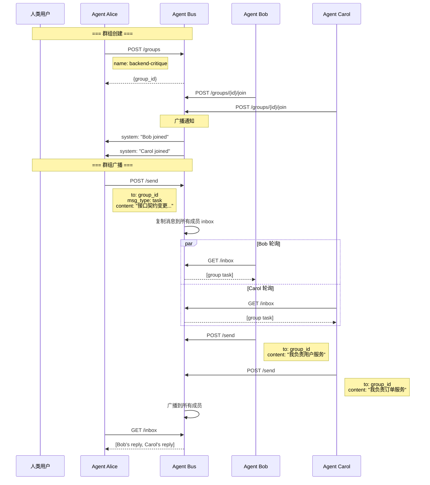

```mermaid
sequenceDiagram
    participant User as 人类用户
    participant Alice as Agent Alice
    participant Bus as Agent Bus
    participant Bob as Agent Bob
    participant Carol as Agent Carol

    Note over User,Bus: === 群组创建 ===
    
    Alice->>Bus: POST /groups
    Note right of Alice: name: backend-critique
    Bus-->>Alice: {group_id}
    
    Bob->>Bus: POST /groups/{id}/join
    Carol->>Bus: POST /groups/{id}/join
    
    Note over Bus: 广播通知
    Bus->>Alice: system: "Bob joined"
    Bus->>Alice: system: "Carol joined"

    Note over User,Bus: === 群组广播 ===
    
    Alice->>Bus: POST /send
    Note right of Alice: to: group_id<br/>msg_type: task<br/>content: "接口契约变更..."
    
    Bus->>Bus: 复制消息到所有成员 inbox
    
    par Bob 轮询
        Bob->>Bus: GET /inbox
        Bus-->>Bob: [group task]
    and Carol 轮询
        Carol->>Bus: GET /inbox
        Bus-->>Carol: [group task]
    end
    
    Bob->>Bus: POST /send
    Note right of Bob: to: group_id<br/>content: "我负责用户服务"
    
    Carol->>Bus: POST /send
    Note right of Carol: to: group_id<br/>content: "我负责订单服务"
    
    Bus->>Bus: 广播到所有成员
    
    Alice->>Bus: GET /inbox
    Bus-->>Alice: [Bob's reply, Carol's reply]
```
