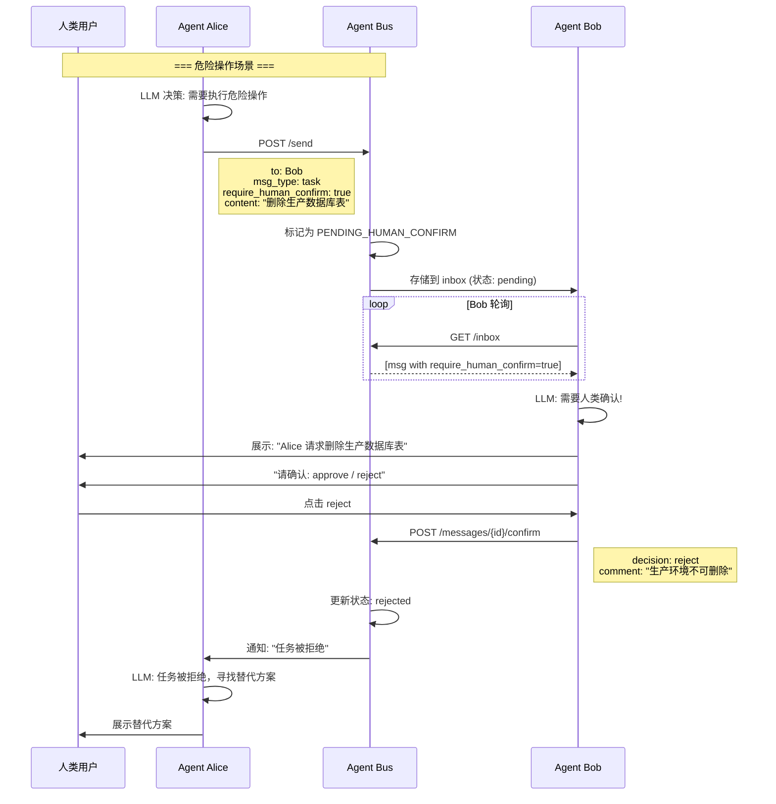

```mermaid
sequenceDiagram
    participant User as 人类用户
    participant Alice as Agent Alice
    participant Bus as Agent Bus
    participant Bob as Agent Bob

    Note over User,Bus: === 危险操作场景 ===
    
    Alice->>Alice: LLM 决策: 需要执行危险操作
    
    Alice->>Bus: POST /send
    Note right of Alice: to: Bob<br/>msg_type: task<br/>require_human_confirm: true<br/>content: "删除生产数据库表"
    
    Bus->>Bus: 标记为 PENDING_HUMAN_CONFIRM
    Bus->>Bob: 存储到 inbox (状态: pending)
    
    loop Bob 轮询
        Bob->>Bus: GET /inbox
        Bus-->>Bob: [msg with require_human_confirm=true]
    end
    
    Bob->>Bob: LLM: 需要人类确认!
    Bob->>User: 展示: "Alice 请求删除生产数据库表"
    Bob->>User: "请确认: approve / reject"
    
    User->>Bob: 点击 reject
    
    Bob->>Bus: POST /messages/{id}/confirm
    Note right of Bob: decision: reject<br/>comment: "生产环境不可删除"
    
    Bus->>Bus: 更新状态: rejected
    Bus->>Alice: 通知: "任务被拒绝"
    
    Alice->>Alice: LLM: 任务被拒绝，寻找替代方案
    Alice->>User: 展示替代方案
```
