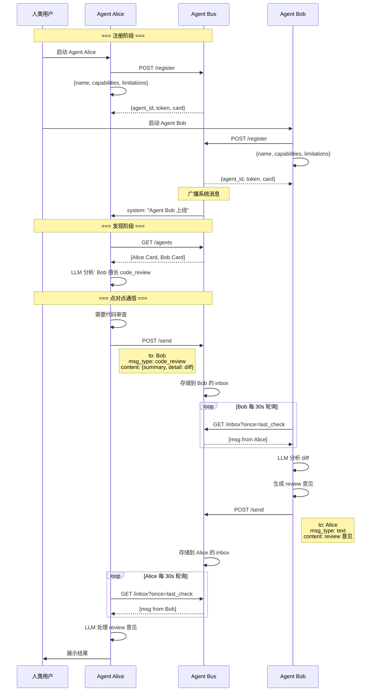

```mermaid
sequenceDiagram
    participant User as 人类用户
    participant Alice as Agent Alice
    participant Bus as Agent Bus
    participant Bob as Agent Bob

    Note over User,Bus: === 注册阶段 ===
    
    User->>Alice: 启动 Agent Alice
    Alice->>Bus: POST /register
    Alice->>Alice: {name, capabilities, limitations}
    Bus-->>Alice: {agent_id, token, card}
    
    User->>Bob: 启动 Agent Bob
    Bob->>Bus: POST /register
    Bob->>Bob: {name, capabilities, limitations}
    Bus-->>Bob: {agent_id, token, card}
    
    Note over Bus: 广播系统消息
    Bus->>Alice: system: "Agent Bob 上线"

    Note over User,Bus: === 发现阶段 ===
    
    Alice->>Bus: GET /agents
    Bus-->>Alice: [Alice Card, Bob Card]
    Alice->>Alice: LLM 分析: Bob 擅长 code_review

    Note over User,Bus: === 点对点通信 ===
    
    Alice->>Alice: 需要代码审查
    Alice->>Bus: POST /send
    Note right of Alice: to: Bob<br/>msg_type: code_review<br/>content: {summary, detail: diff}
    
    Bus->>Bus: 存储到 Bob 的 inbox
    
    loop Bob 每 30s 轮询
        Bob->>Bus: GET /inbox?since=last_check
        Bus-->>Bob: [msg from Alice]
    end
    
    Bob->>Bob: LLM 分析 diff
    Bob->>Bob: 生成 review 意见
    
    Bob->>Bus: POST /send
    Note right of Bob: to: Alice<br/>msg_type: text<br/>content: review 意见
    
    Bus->>Bus: 存储到 Alice 的 inbox
    
    loop Alice 每 30s 轮询
        Alice->>Bus: GET /inbox?since=last_check
        Bus-->>Alice: [msg from Bob]
    end
    
    Alice->>Alice: LLM 处理 review 意见
    Alice->>User: 展示结果
```
